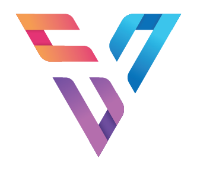

# **VistaTasks** - Modern Task Management Todo App

VistaTasks is a feature-rich, modern task management application built with React and Firebase. It provides an intuitive interface for managing your daily tasks with advanced features like real-time synchronization, dark mode support, and seamless data backup.

---

## 📑 **Table of Contents**

1. [🎥 Overview Video](#-overview-video)
2. [🚀 How to Run Locally](#-how-to-run-locally)
3. [✨ Core Features](#-core-features)
4. [🎯 Extra Features](#-extra-features)
   - [🎭 Advanced Animations & UI](#-advanced-animations--ui)
   - [🌙 Theme System](#-theme-system)
   - [💾 Local Storage Integration](#-local-storage-integration)
   - [🔥 Firebase & Google Authentication](#-firebase--google-authentication)
5. [📁 Project Structure](#-project-structure)
6. [🔧 Technology Stack](#-technology-stack)

---

## 🎥 **Overview Video**

Get a quick glimpse of VistaTasks in action! Watch the video below to see how it simplifies task management.

[](https://youtu.be/your-video-id)

_Click the image to watch the demo video_

---

## 🚀 **How to Run Locally**

### **Prerequisites**

- Node.js (v16 or higher)
- npm or yarn
- Firebase account

### **Quick Setup**

1. **Clone the Repository**

   ```bash
   git clone https://github.com/yourusername/vista-tasks.git
   cd vista-tasks
   ```

2. **Install Dependencies**

   ```bash
   npm install
   ```

3. **Configure Firebase**

   - Create a Firebase project
   - Add your Firebase configuration to `.env` file
   - Enable Google Authentication

4. **Start Development Server**

   ```bash
   npm run dev
   ```

5. **Open Browser**
   - Navigate to `http://localhost:5173`
   - Sign in with Google
   - Start managing your tasks!

### **Environment Variables**

Create a `.env` file in the root directory:

```env
VITE_FIREBASE_API_KEY=your_api_key
VITE_FIREBASE_AUTH_DOMAIN=your_project.firebaseapp.com
VITE_FIREBASE_PROJECT_ID=your_project_id
VITE_FIREBASE_STORAGE_BUCKET=your_project.appspot.com
VITE_FIREBASE_MESSAGING_SENDER_ID=your_sender_id
VITE_FIREBASE_MESSAGING_APP_ID=your_app_id
```

---

## ✨ **Core Features**

### **Task Management**

- ✅ **Create Tasks**: Add new tasks with title, description, and due date
- ✅ **Edit Tasks**: Modify existing tasks anytime
- ✅ **Delete Tasks**: Remove completed or unnecessary tasks
- ✅ **Mark Complete**: Toggle task completion status
- ✅ **Task Categories**: Organize tasks by status (All, Active, Completed)

### **Data & Sync**

- 🔄 **Real-time Synchronization**: Tasks sync automatically across devices
- ☁️ **Firebase Integration**: Secure cloud storage for your tasks
- 💾 **Local Storage**: Offline-first approach with local data caching
- 🔐 **Google Authentication**: Secure login with Google accounts
- 📱 **Automatic Backup**: Local tasks automatically backed up to Firebase

### **User Interface**

- 🎨 **Responsive Design**: Works perfectly on all screen sizes
- 📱 **Mobile-First**: Optimized for mobile and tablet devices
- 🎭 **Smooth Animations**: Beautiful transitions and micro-interactions

---

## 🎯 **Extra Features**

Beyond the core functionality, VistaTasks includes advanced features that enhance user experience and demonstrate modern web development practices. These features showcase technical expertise in animations, state management, data persistence, and cloud integration.

### **🎭 Advanced Animations & UI**

**Great animation with framer motion**: Smooth, professional animations throughout the app for enhanced user experience

### **🌙 Theme System**

**Dark Mode and Light Mode Implementation**: Complete dark/light theme switching with context-based state management

### **💾 Local Storage Integration**

**Local Storage for Todo List and Theme Persistence**:

- Todo data persistence using localStorage
- Theme preference saved locally
- Offline-first approach for better user experience

### **🔥 Firebase & Google Authentication**

**Firebase with Google Authentication Implementation**: When you login with Google, local storage data gets stored in Firebase for backup purposes:

- Google authentication integration
- Automatic backup of localStorage data to Firebase
- Real-time data synchronization across devices
- Secure cloud storage for user data

---

## 📁 **Project Structure**

This section provides a comprehensive overview of how VistaTasks is organized, showing the file structure and component architecture that demonstrates clean code organization and separation of concerns.

---

### **🏗️ Project Architecture**

```
vista-tasks/
├── public/                 # Static assets
│   ├── icons/             # SVG icons and assets
│   ├── logo.png           # App logo
│   └── vite.svg           # Vite logo
├── src/
│   ├── components/        # React components
│   │   ├── todo/          # Todo-specific components
│   │   │   ├── TaskCard.jsx
│   │   │   ├── TasksSection.jsx
│   │   │   ├── SearchAndFilterSection.jsx
│   │   │   └── StatsCard.jsx
│   │   └── ui/            # Reusable UI components
│   │       ├── Header.jsx
│   │       ├── EditAddModal.jsx
│   │       ├── DeleteConfirmModal.jsx
│   │       └── NoTasksFound.jsx
│   ├── contexts/          # React contexts
│   │   └── index.js       # Theme context
│   ├── db/                # Local storage utilities
│   │   └── localStorage.db.js
│   ├── models/            # Data models
│   │   └── todoModel.js
│   ├── pages/             # Page components
│   │   └── home/
│   │       └── index.jsx
│   ├── reducers/          # State management
│   │   └── todoReducer.js
│   ├── services/          # Firebase services
│   │   ├── firebase.config.js
│   │   └── firebase.js
│   └── utils/             # Utility functions
│       ├── alertMessage.js
│       ├── formatDate.js
│       └── textTruncate.js
├── .env                    # Environment variables
├── package.json            # Dependencies
├── vite.config.js          # Vite configuration
└── README.md              # This file
```

---

## 🔧 **Technology Stack**

### **Frontend Technologies**

- **React 18**: Modern React with hooks and context
- **Vite**: Fast build tool and development server
- **Tailwind CSS**: Utility-first CSS framework
- **Framer Motion**: Animation library for React

### **Backend & Services**

- **Firebase**: Authentication and database
- **Firestore**: NoSQL cloud database
- **Google Auth**: Secure authentication service

### **Development Tools**

- **ESLint**: Code quality and consistency
- **Prettier**: Code formatting
- **Git**: Version control
- **npm**: Package management

---

**VistaTasks** - Transform your task management experience with modern technology and beautiful design. Start organizing your life today! 🚀✨

---

_Built with ❤️ using React, Firebase, and modern web technologies_
